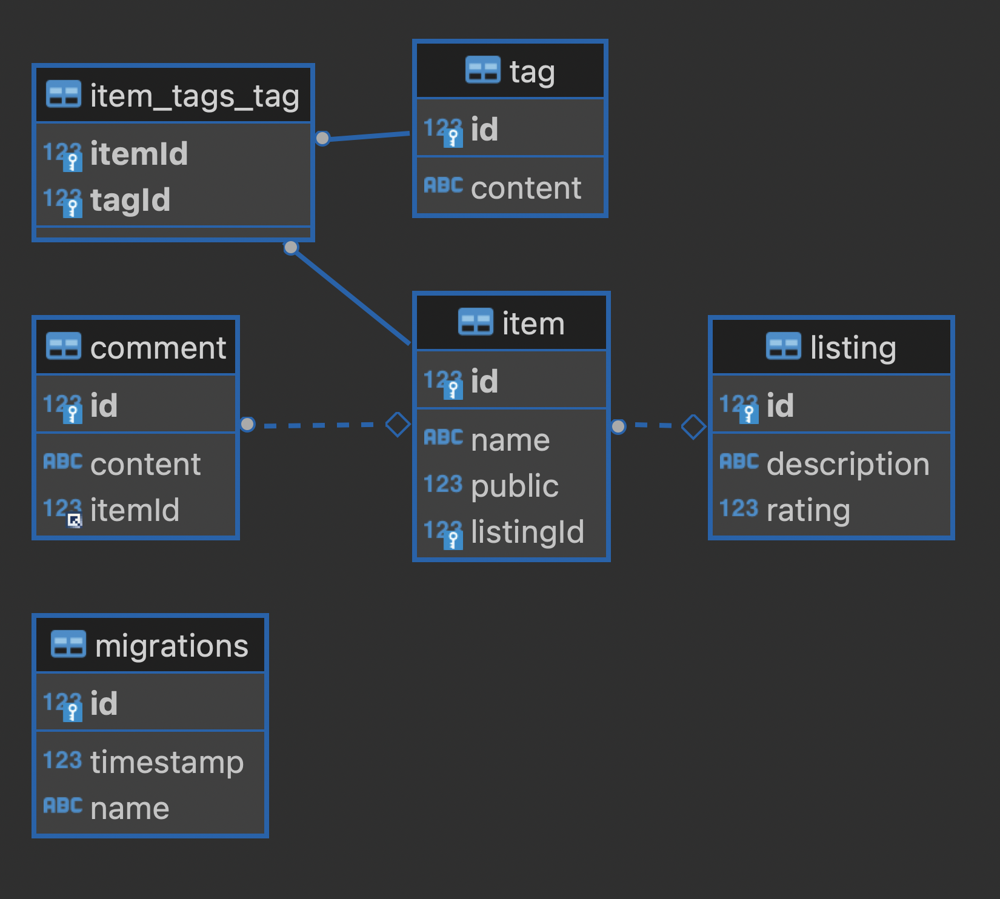

# NestJS + TypeORM Tutorial 

> [NestJS + TypeORM Tutorial](https://www.youtube.com/watch?v=9MGKKJTwicM)영상을 보고 학습한 내용을 정리 합니다.

<br/>

## 🌿 목차

### 1. Setting

- [Setting 정리](./docs/1.Setting.md)

### 2. Repositories

- Repository
- EntityManager

### 3. Relations

- 1:1(One to One)
  - items <-> listing: 하나의 아이템(1)과 해당 아이템(1)에 대한 설명
- 1:N(One to Many)
  - item <-> comment: 하나의 아이템(1) 여러개(N)의 댓글
- N:1(Many to One)
  - comment <->: 여러개의 댓글(N)은 하나의 아이템(1)에 대한 것
- N:M(Many to Many)
  - item <- joinTable -> tag: 여러개의 게시물(N)에 여러개의 태그(M)

### 4. Transactions

- [updateTransaction Function](./src/items/entities/item.entity.ts)

### 5. Subscribers

- [items.subscriber.ts](./src/items/items.subscriber.ts)

### 6. Migrations

```bash
# 마이그레이션 파일 생성
npm run typeorm:create-migration --name=PublicItems
# 마이그레이션 파일 실행
npm run typeorm:run-migrations
# 마이그레이션 파일 되돌리기
npm run typeorm:revert-migrations
```

### 7. Testing

```bash
npm run test items.service
```

## 🌿 DB

### ERD


